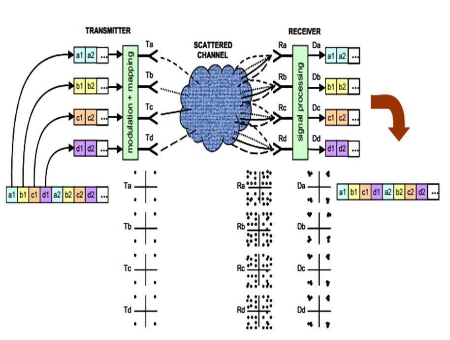
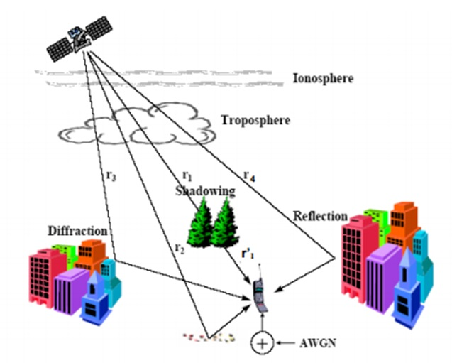

This repository is dedicated to providing a comprehensive solution for equalizing attenuations encountered in MIMO (Multiple Input, Multiple Output) satellite links. The model addresses the challenge of mitigating signal degradation caused by diverse factors as it traverses through various orbits before reaching the terrestrial stations. Leveraging the powerful Recursive Least Squares (RLS) algorithm, our solution ensures robust signal equalization, enhancing the reliability and efficiency of satellite communication systems. 
The model offers a sophisticated mechanism to counteract signal attenuation induced by atmospheric conditions, orbital dynamics, and other environmental factors.  By implementing MIMO techniques, our solution maximizes spectral efficiency and minimizes interference, thereby improving overall link performance. The Recursive Least Squares algorithm serves as the backbone of our equalization strategy, dynamically adapting to changing channel conditions for optimal signal recovery.

